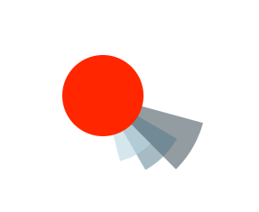
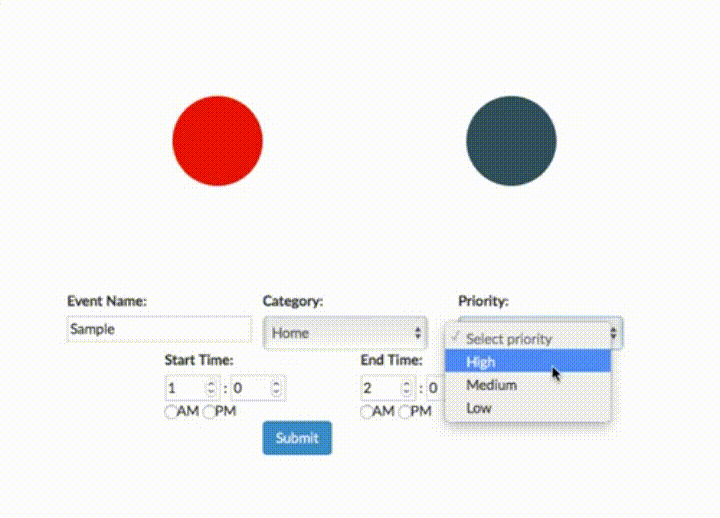

# Schedule Circle

###Introduction:

This project is a proof-of-concept of a new design for planners and schedules. The design is for a day to be represented as a circle and events to be wedges protruding out.

The length of the event is represented in the degrees of the wedge. The category and priority of the event is represented by the color and distance from the center respectively.

###In Action

[Live Version on Heroku](https://circle-sched.herokuapp.com)

###How to Use

Open the `index.html` document in your browser of choice. Fill out the form with event details and click submit to see the arc(s) representing the event show up on the circles. 

If you wish to see details of an event you've already created click on the arc. To the right of the circles the event name and the start and end times will be shown. If you no longer want to see that information, just click inside one of the circles to make it disappear. 

###Implementation:

The project uses HTML5 forms, Bootstrap, and Angular.js. The circle and wedges are drawn with SVG.

The data submitted from the form is sent to the MainCtrl controller. The controller checks that all fields are filled, then calls the create method of arcs. arcs proceeds to check data for validity and generate the path for the arc.

###TODO:

* stretch - allow changing color schemes
