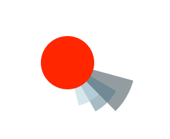

# Schedule Circle

###Introduction:

This project is a proof-of-concept of a new design for planners and schedules. The design is for a day to be represented as a circle and events to be wedges protruding out. 

The length of the event is represented in the degrees of the wedge. The category and priority of the event is represented by the color and distance from the center respectively. 

###Implementation:

The project uses HTML5 forms and Angular.js. The circle and wedges are drawn with SVG. 

The data submitted from the form is sent to the MainCtrl controller. The controller checks that all fields are filled, then calls the create method of arcs. arcs proceeds to check data for validity and generate the path for the arc.

###TODO:
* More README info
* make form better looking
* implement way to see existing event info
* move functions into factory
* stretch - allow changing color schemes

